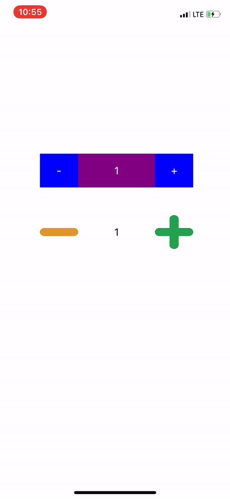

# SJStepper



## Usage
```swift
let stepper = SJStepper(minusTitle: "-", plusTitle: "+")

let imageStepper = SJStepper(minusNormalImage: "minus",
                              minusHighlightedImage: nil,
                              plusNormalImage: "plus",
                              plusHighlightedImage: nil)
```

### Configuring SJStepper Property
```swift
stepper.startValue = 1
stepper.minValue = 0
stepper.maxValue = 200
stepper.isSlideGesture = true
stepper.isVibrateAnimation = true
```

### Custom
```swift
let stepper = SJStepper(minusTitle: "-", plusTitle: "+")
stepper.frame = CGRect(x: 65, y: 250, width: 250, height: 55)
stepper.backgroundColor = .purple
stepper.minusButton.backgroundColor = .blue
stepper.plusButton.backgroundColor = .blue
stepper.minusButton.setTitleColor(.white, for: UIControlState.normal)
stepper.plusButton.setTitleColor(.white, for: UIControlState.normal)
stepper.countLabel.textColor = .white

let imageStepper = SJStepper(minusNormalImage: "minus", minusHighlightedImage: nil, plusNormalImage: "plus", plusHighlightedImage: nil)
imageStepper.frame = CGRect(x: 65, y: 350, width: 250, height: 55)
imageStepper.startValue = 1
imageStepper.minValue = 0
imageStepper.maxValue = 200
imageStepper.isSlideGesture = true
imageStepper.isVibrateAnimation = false
```
